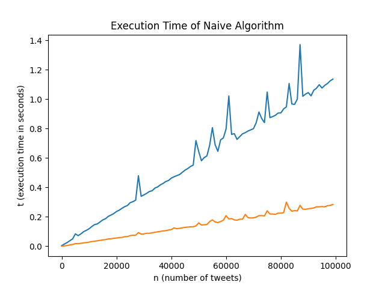

# UBC-COSC320-Project

run `python main.py` to get the runtime graph
of the algorithms.

run `python test.py` to check both algorithms
return the same result.

The algorithms are in `algorithm.py` and loading
data is done in `data.py`.

A sample output of the runtime graph is
`NaiveVsEfficient.png`.

